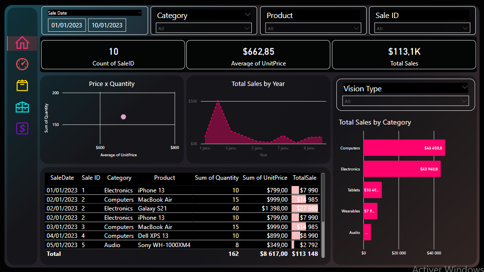

# 🛍️ Sales Dashboard – Power BI Project 03

This project presents a visually engaging Power BI dashboard that monitors key sales indicators including total sales, unit prices, product category performance, and customer insights. With a modern layout inspired by Figma, the dashboard provides a clear overview for decision-makers and sales managers.

---

## 🎯 Objective

The goal of this dashboard is to provide a business-friendly view of sales activities with the ability to filter by product, category, and time — making it easy to track revenue, volume, and pricing strategies over time.

---

## 📁 Dataset

- 📂 Source: Excel file with sample sales transactions
- Key columns:
  - Sale Date
  - Product Name
  - Product Category
  - Quantity Sold
  - Unit Price
  - Total Sales
  - Vision Type (filtering dimension)

(*All data is fictitious or anonymized for demonstration purposes.*)

---

## 📸 Screenshots

### 💡 Main View


---

## 📈 Key Features

- 💵 **Total Sales, Count of Sales, and Average Price**
- 📊 **Sales by Category, Product, and Date**
- 🧮 **Calculated fields** for quantity × unit price
- 🎯 **Dynamic slicers**: Sale Date, Category, Product, and Vision Type
- 📐 **Bubble chart** to visualize price vs quantity
- 📅 **Sales Trend by Date**

---

## 🛠️ Tools Used

- **Power BI** – Data modeling, calculated measures, and visualization  
- **Excel** – Data cleaning and source formatting  
- **Figma** – Dashboard layout and design inspiration

---

## 🔢 DAX Examples Used

Below are a few custom DAX measures created for this dashboard:

### 🧮 Total Sales
```DAX
TotalSale = SUMX('DataSet', 'DataSet'[Quantity] * 'DataSet'[UnitPrice])
```

```DAX
IsInScope_Product = IF(ISINSCOPE('DataSet'[SaleID]), SELECTEDVALUE('DataSet'[Product]), "--")
```

## 📚 Key Learnings

- Creating a sleek, dark-themed interface with custom visuals
- Building custom KPIs and applying dynamic filtering
- Using slicers for a better user experience
- Implementing a price × quantity relationship in scatter plots

---

## 🔗 Live Demo or Post

📢 Check out the [LinkedIn post here](https://www.linkedin.com/feed/update/urn:li:activity:7219329663569965056/)

---

## 📩 Contact

**Salma Elhila**  
📧 elhilasalma@gmail.com  
🔗 [LinkedIn](https://www.linkedin.com/in/your-profile/)  
🔗 [GitHub](https://github.com/your-username)
